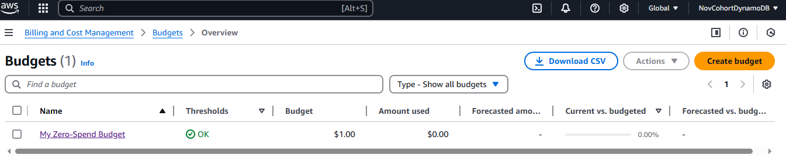

# aws-setup

## Account Creation
-- In this project, I setup an AWS account in order to use its DynamoDB service.  The account process included creating a zero-budget for its free-tier service.

-- I also created an IAM user with Admin Access.  This user will be used for daily tasks, so I will sign-in using this "account" instead of the root user.

## AWS Budget Setup

## Dynamo Exploration
-- After reading a bit about DynamoDB, I think one of my key insights is that it is used a larger scale then what I thought. From Entertainment to Banking/Finance, DynamoDB's capabilities are almost endless.  One thing I do like is the cheatsheet provided for quick references. As someone who has never worked with DynamoDB, this could really be helpful.

